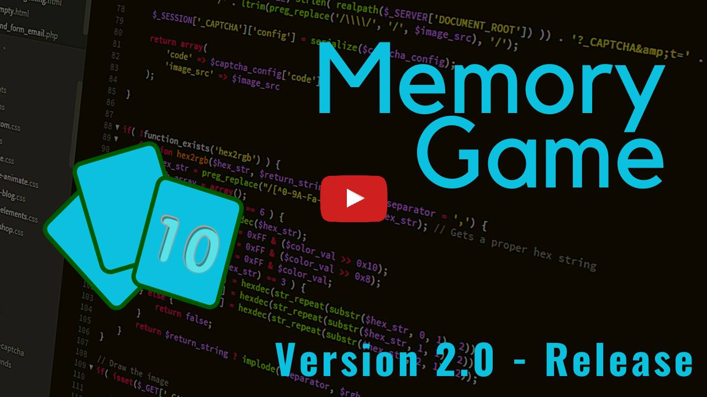

# Memory Game

## Apresentação do Projeto

## O que é?

O Memory Game é um jogo formado por cartas que apresentam uma figura em um dos lados, sendo que cada figura se repete em duas cartas diferentes. Sua missão é conseguir encontrar todos os pares iguais.

## Objetivo do Projeto:

Decidi desenvolver este jogo para aprender mais sobre JavaScript. Muitas das funcionalidades presentes no jogo, eu aprendi a desenvolvê-las durante o desenvolvimento. E valeu a pena.

## 🛠️ CRUD:
Neste jogo, você pode:
- Criar uma conta.
- Ler os dados da conta pelo terminal ou pelo menu do perfil.
- Atualizar dados da conta, como:
  - Foto de perfil
  - Nome de usuário.
- Deletar contas.

## 💻 Features:
- Design responsivo.

- Seleção de idiomas: Português e Inglês.

- Menu inicial com 4 opções:
  - Jogar
  - Configurações
  - Terminal
  - Créditos

- Temas disponíveis para as cartas:
  - Ben 10
  - Boku No Hero
  - Boruto
  - Dragon Ball
  - Gilmore Girls
  - Hora de Aventura
  - Nanatsu No Taizai
  - Naruto
  - One Piece
  - One Punch Man

- Dificuldades:
  - Fácil: 8 cartas.
  - Normal: 14 cartas.
  - Difícil: 20 cartas, e todas as cartas nesta dificuldade são expostas ao usuário por 3 segundos, assim que o jogo começa.
- Sistema de vidas na dificuldade Difícil:
  - O usuário possuí 5 vidas, e se perder todas elas, ele estará fora da partida. Mas se acertar uma combinação, ele recuperará uma vida.

- Modos de jogo:
  - Clássico: te permite escolher o tema e a dificuldade que deseja jogar.
  - Aleatório: o sistema iniciará uma partida com um tema e uma dificuldade aleatórios.

- Sistema de templates que incluí:
  - Paleta de Cores
  - Imagem e Música de Fundo
  - Fonte de Texto

- Sistema de sons:
  - Músicas
  - Efeitos Sonoros
  - Botões para ativar/desativar os sons.
  - Barra de volume para alternar o volume dos sons.

- Transições e animações com keyframes.

- Sistema de conquistas.

- Sistema de cadastro e login.

- Dados de cadastro salvos no LocalStorage.

- Contagem de movimentos de cartas.

- Sistema de níveis:
  - Niveís: 0 a 10.
  - Você ganha experiência ao completar conquistas e partidas, e sobe de nível ao atingir a meta de experiência exigida.

- Foto de perfil possuí 3 opções:
  - Upload de imagem: você pode importar uma imagem do seu computador para usar como foto de perfil.

  - Importação de imagem através de link: você pode importar uma imagem da internet ao utilizar um link de imagem.

  - Avatares: o Jogo da Memória te oferece opções de imagens, baseadas em categorias como animais, profissões etc.

- Informações gerais de perfil:
  - Data de criação da conta.
  - Partidas jogadas.
  - Vitórias.
  - Derrotas.
  - Sequência de vitórias.

- Sistema de combo ao fazer combinações de cartas de forma sequencial em um curto período de tempo.

- Menu Kebab que fornece duas opções:
  - Remover foto de perfil.
  - Desconectar a conta.

- Terminal:
  - Central de Ajuda: mostra os comandos disponíveis no terminal.

  - Entrada de texto: te permite usar os comandos do terminal para buscar um dado ou alterá-lo.

  - Botão de alternância: te permite ocultar/revelar a Central de Ajuda.

- Botão de abandonar/sair da partida.

- As versões em português e inglês possuem duas variações: uma com ECMAScript Modules e a outra com todo o JavaScript em apenas um único arquivo.

## 🔗 Acesse o projeto:

Para jogar o Memory Game, [clique aqui](https://mmgame.vercel.app/).

## 🤝🏻 Como contribuir
Para contribuir com esse projeto, basta seguir os passos abaixo:

1. Faça um fork desse repositório em sua conta pessoal no Github;
2. Crie uma branch de feature/nome-da-feature em seu repositório;
3. Faça commits e encha essa branch criada com bastante conteúdo;
4. Faça um pull request da sua branch para este repositório;
5. Acompanhe a avaliação do pull-request e responda se necessário.

Caso tenha alguma dúvida durante esse processo, crie uma issue nesse repositório.

## Créditos

Eu pude começar este projeto graças a [Marina Ferreira](https://github.com/marina-ferreira)! A base mínima dos cards com HTML, CSS e JS, eu peguei dela, então deixo os créditos aqui. Acesse o código fonte dela [clicando aqui](https://marina-ferreira.github.io/tutorials/js/memory-game/).

**OBS: Apenas a base do código veio dela, que peguei quando eu estava no começo do desenvolvimento. As features foram desenvolvidas por mim mesmo.**

## 👋🏻 Não pare por aqui!

Gostou do meu projeto? Então me acompanhe nas redes sociais, principalmente no LinkedIn, para ficar por dentro das minhas últimas aplicações!

- [Instagram](https://www.instagram.com/guiidev_/)
- [Linkedin](https://www.linkedin.com/in/guilhermescr/)
- [Youtube](https://www.youtube.com/@devguiga)

*Developed by Guilherme Rocha - 2023.*

[⬆ Voltar ao topo](#memory-game) 
